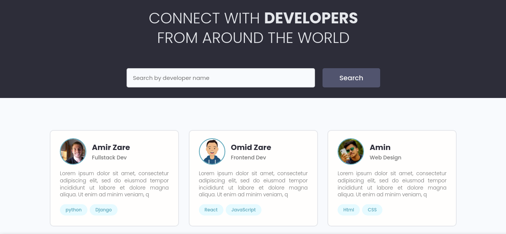
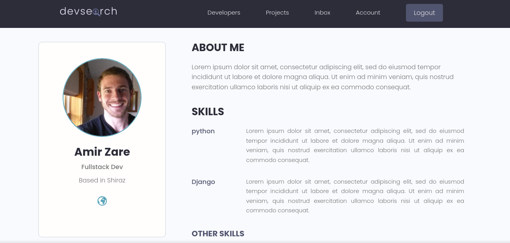
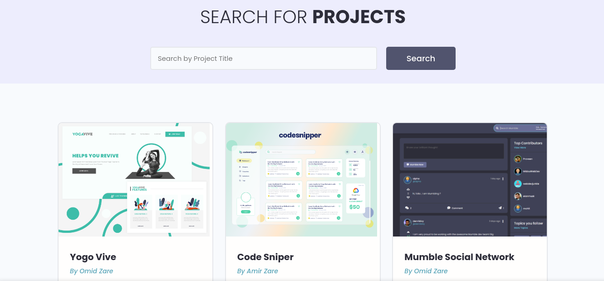
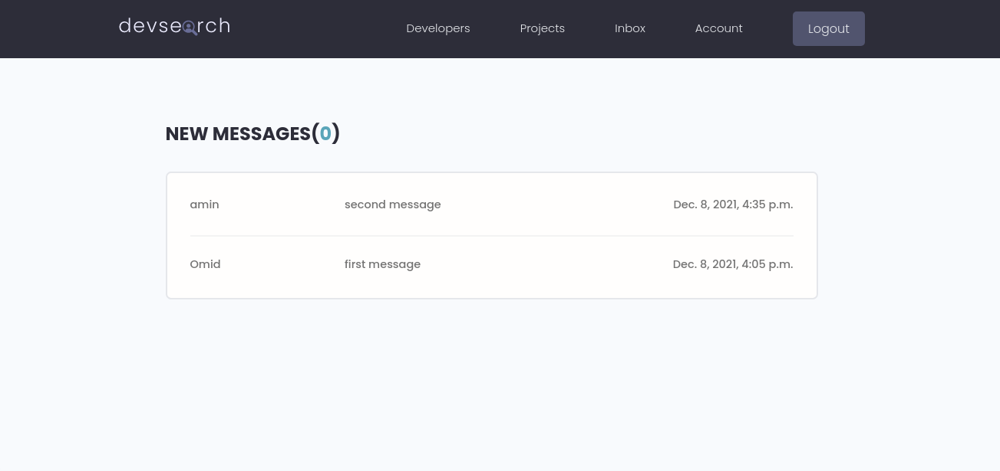
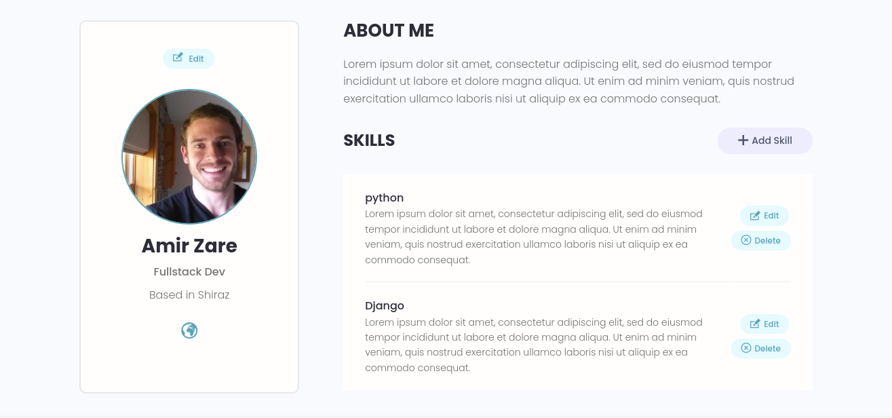
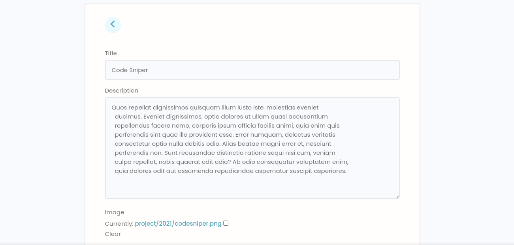
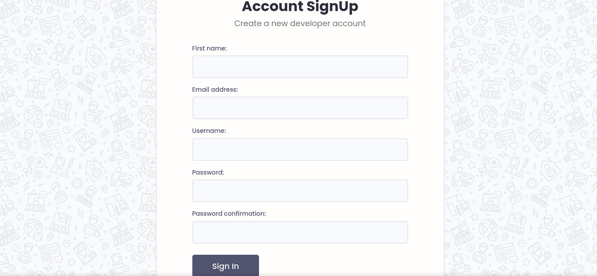
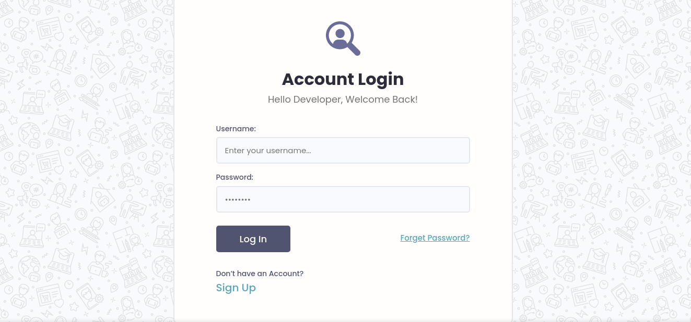

# Django-DevSearch

In this program, you can communicate with other programmers and also put your projects and skills in your profile. This app was created by Django.

# Screenshots

## Main Page

On the home screen you can see all the programmers that are paginated. It can also be searched by the name of each programmer.

## Profile

You can see the profile of each programmer, where on the profile page you can find information such as the capabilities and projects of each programmer, as well as individual information.

## Projects

On the Projects page you can access projects done by developers. You can also search for them by title.

## Messages

In this section you can access and read messages sent to you by other users.

## Accounts

In the Account section, you can easily edit or delete your personal information, skills and projects.

## Register And Login

With this section, you can login to your account or register if you do not have an account on the site yet. Also, if you forget your password, you can easily reset it.

# License

[GNU v3](LICENSE)
